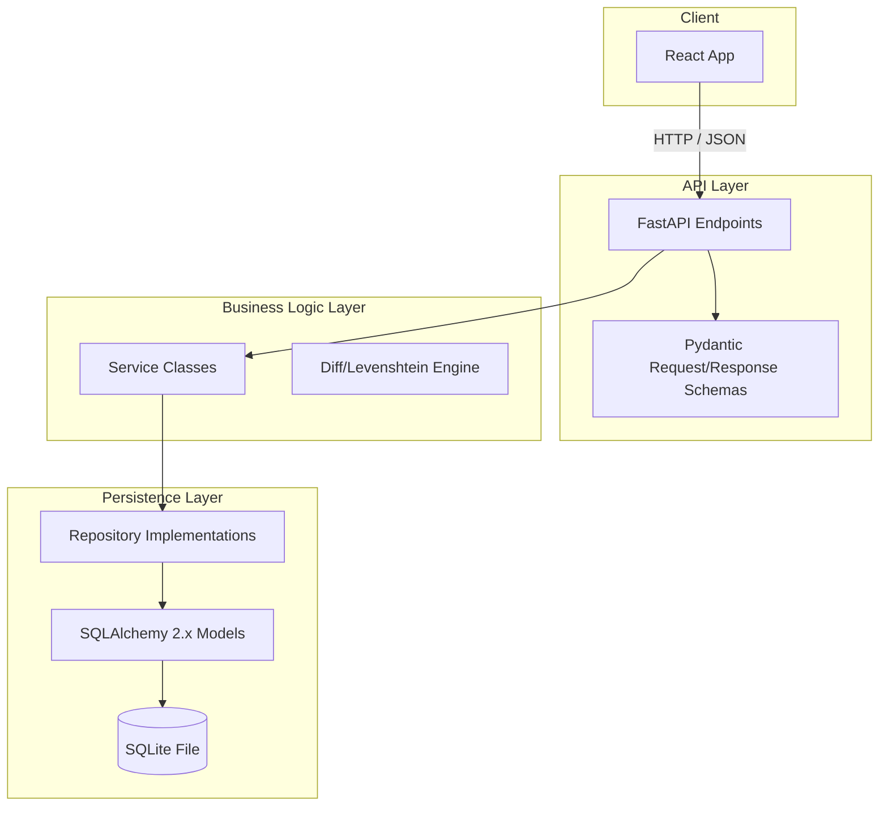
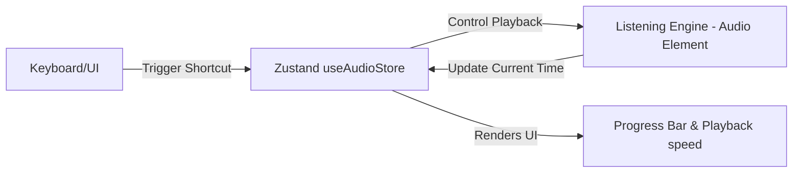

# Software Architecture Specification

This document specifies the software architecture for the Dictation Practice application, covering both Backend (FastAPI, SQLite, SQLAlchemy 2.x) and Frontend (React, Vite, TypeScript, TailwindCSS, React Query, Zustand).

---

## 1. Architectural Patterns

### 1.1 Backend: Clean Architecture & API-First
The backend strictly separates core domain logic from framework, delivery, and database components. The architecture is split into the following directories:

*   **Domain (Entities/Business Rules)**: `backend/models/`
    *   Defines the core structures and relationships. Pure Python/Pydantic/SQLAlchemy models without external dependency imports.
*   **Use Cases (Service Layer)**: `backend/services/`
    *   Defines business logic operations (e.g., text parsing, diffing algorithms, calculation of accuracy, statistics generation).
*   **Interface Adapters (Repository Layer & Controllers)**: `backend/repositories/` & `backend/api/`
    *   `repositories/` abstracts data access patterns, enabling SQLite to be swapped with PostgreSQL or MySQL later without changing services.
    *   `api/` contains FastAPI routers (controllers) that handle HTTP requests/responses, request validation, and mapping exceptions to HTTP status codes.
*   **Infrastructure & Utilities**: `backend/config/`, `backend/utils/`, `backend/db/`
    *   Configuration management (Pydantic settings), SQLite database session lifecycle, migrations (Alembic), and text diff utilities.

### 1.2 Frontend: Feature-Based & Component-Driven
The frontend is modularized around React components and hooks, keeping components focused and reusable.

*   **Views**: Single Page Application (SPA) driven by React Router.
    *   `DashboardView`: Landing page with analytics, statistics, and lesson management.
    *   `PracticeView`: Deliberate practice environment with side-by-side comparison, segment lists, and player controls.
*   **State Management**:
    *   **Server State (React Query)**: Caches and manages all backend server data, including lessons list, statistics, and segment states.
    *   **Client State (Zustand)**: Manages local transient state:
        *   `useAudioStore`: Audio player configurations (playback speed, loop status, current time, duration, volume).
        *   `useUIStore`: UI preferences (dark mode status, keyboard shortcut helper toggle).
*   **Services / Client SDK**: Axios client configured with intercepts to interact with the backend API.

---

## 2. Backend Module Breakdown

### 2.1 Domain Models
Defines structural representations of `Lesson`, `AudioFile`, `Transcript`, `Segment`, `Attempt`, and `Bookmark`.

### 2.2 Repository Pattern
Decouples domain logic from database commands. Every repository interface implements CRUD operations.
*   `LessonRepository`: Handles lesson storage and retrieval.
*   `SegmentRepository`: Handles individual segments and state queries.
*   `AttemptRepository`: Handles immutable log entries for user typing attempts.
*   `BookmarkRepository`: Toggles segment bookmarks.

### 2.3 Service Layer
Coordinates complex business logic that spans multiple entities.
*   `LessonService`: Uploading files, parsing SRT/TXT, managing directory storage.
*   `PracticeService`: Checking user input, calculating Levenshtein distance, producing synchronized diffs, storing attempt logs.
*   `DashboardService`: Processing metrics, aggregating average accuracy, total listening time, and spelling error lists.

---

## 3. Frontend Architecture

### 3.1 Listening Engine Component Design
The Listening Engine wraps the HTML5 `<audio>` element with custom controllers that interface with Zustand and standard keyboard event listeners.

To achieve sub-100ms response times for looping and segment switching, the entire audio file is loaded once. Switching segments updates the `currentTime` pointer of the active audio element and hooks into the `timeupdate` event to automatically pause or loop when the boundary is crossed.

---

## 4. Infrastructure & Deployment Model

The system is fully containerized using **Docker** and orchestrated using **Docker Compose**:

*   **`backend` Container**: Builds on `python:3.12-slim`, exposes FastAPI, and mounts a persistent volume for storing uploaded `.mp3` and `.wav` files and the `dictation.db` SQLite file.
*   **`frontend` Container**: Vite development environment mapping the local filesystem for hot-reloading in development. A production build builds to static HTML/JS/CSS served via Nginx.
