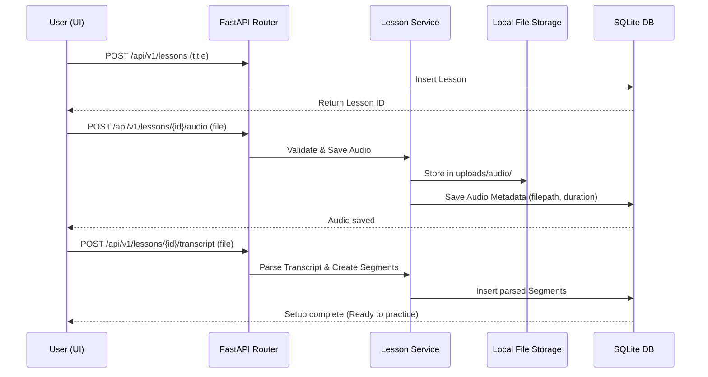
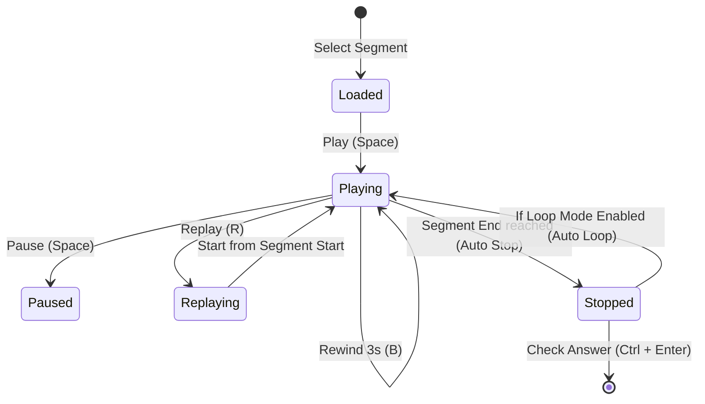

# Business Workflows and Process Logic

This document specifies the business flows, algorithm parameters, and state transitions of the Dictation Practice system.

---

## 1. Lesson Creation and Media Setup Workflow

This flow represents the loading of materials before practice can begin.

### 1.1 Transcript Parsing Logic (FR-004)
*   **SRT Format**:
    *   Parse the timestamp format: `00:00:01,234 --> 00:00:05,678` -> Convert to float seconds (`1.234` and `5.678`).
    *   Clean subtitles from metadata (remove HTML tags like `<i>`, `<b>`, ``).
    *   Store clean transcript string alongside timestamps.
*   **TXT Format**:
    *   Create a single segment covering the entire lesson (`start_time = 0.0`, `end_time = audio_duration`).
*   **JSON Format**:
    *   Direct mapping of list of segments: `{ "segments": [ { "start": float, "end": float, "transcript": string } ] }`.

---

## 2. Practice Session & Listening Engine Control Loop

This describes how the player controls media playback and keyboard shortcuts to keep the user inside the dictation flow.

*   **Boundary Enforcement**:
    *   Continuous timeupdate check (interval: 100ms).
    *   If `audio.currentTime >= segment.endTime`, trigger `audio.pause()`.
    *   If `loop_enabled == true`, instantly reset `audio.currentTime = segment.startTime` and trigger `audio.play()`.

---

## 3. Answer Checking & Word-Level Diff Algorithm (FR-011)

When a user submits an answer, the backend computes the difference and determines matching accuracy.

### 3.1 Normalization Rule
Before comparison, both the original transcript and the typed answer undergo standard normalization:
1. Convert to lowercase.
2. Remove punctuation (comma, period, question mark, exclamation, quotes, hyphens).
3. Split into whitespace-separated word tokens.

### 3.2 Comparison Logic
The comparison uses a sequence matcher algorithm (similar to Python's `difflib.SequenceMatcher` or a dynamic programming edit-distance matrix) to match tokens side-by-side.

*   **Matching Status Categories**:
    *   `Correct` (Green): Word exists in the same sequence.
    *   `Missing` (Orange): Word in original transcript but omitted in user answer.
    *   `Extra` (Blue): Word typed by user but not present in original transcript.
    *   `Incorrect / Typo` (Red): Word is at the same sequence index but differs.
        *   *Typo classification*: If the Levenshtein distance between original and typed word is $\le 2$ (and the word is $> 3$ characters), flag it as a `Typo` (minor spelling mistake) instead of a completely `Incorrect` word.

### 3.3 Accuracy Metric
$$\text{Accuracy (\%)} = \left( \frac{\text{Number of Correct Words}}{\text{Total Words in Original Segment}} \right) \times 100$$
*   *Note*: Typos/misspelled words are scored as 0.5 correct words, giving partial credit.

### 3.4 Review Queue Trigger (FR-015)
*   If calculated $\text{Accuracy} < 90\%$, set segment status to `Needs Review` and append to the review queue.
*   Otherwise, mark the segment status as `Completed`.
